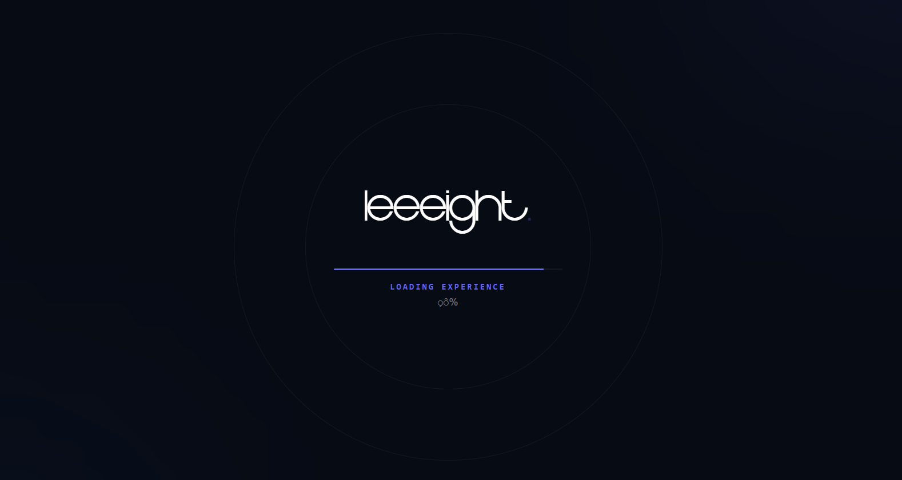

# 🚀 Portfolio Créatif | Creative Developer



Bienvenue sur le dépôt de mon portfolio professionnel, une vitrine moderne et performante conçue pour offrir une expérience utilisateur exceptionnelle.

## 🛠️ Stack Technique

Le projet repose sur les technologies les plus récentes et performantes du marché :

### Cœur & Framework

- **[React 19](https://react.dev/)** : Interface utilisateur réactive.
- **[TanStack Start](https://tanstack.com/start)** : Framework Fullstack moderne offrant SSR (Server-Side Rendering) et une gestion d'état optimisée.
- **[TanStack Router](https://tanstack.com/router)** : Routage typé de bout en bout avec gestion basée sur le dossier `src/pages`.
- **[Bun](https://bun.sh/)** : Runtime JavaScript ultra-rapide utilisé pour le développement et la gestion des paquets.

### Design & Animations

- **[Tailwind CSS v4](https://tailwindcss.com/)** : Framework CSS utilitaire de nouvelle génération pour un design élégant et responsive.
- **[Framer Motion](https://www.framer.com/motion/)** : Animations de composants fluides et premium.
- **[AOS (Animate On Scroll)](https://michalsnik.github.io/aos/)** : Animations déclenchées par le défilement.
- **[Lucide React](https://lucide.dev/)** : Bibliothèque d'icônes modernes et légères.

### Internationalisation (i18n)

- **[Lingui JS](https://lingui.dev/)** : Gestion multilingue (Français/Anglais) avec compilation de messages pour des performances optimales.

### Qualité & Outils

- **[Vitest](https://vitest.dev/)** : Framework de test rapide.
- **[Vite](https://vitejs.dev/)** : Outil de construction (build tool) ultra-rapide.

## ✨ Fonctionnalités Clés

- 🌍 **Internationalisation dynamique** : Basculez entre le Français et l'Anglais instantanément.
- 🌓 **Mode Sombre / Clair** : Thème adaptatif avec persistance via `localStorage`.
- ⚡ **Performance SSR** : Rendu côté serveur pour un SEO optimal et un chargement initial instantané.
- 🎨 **Design Premium** : Glassmorphisme, dégradés animés et typographie soignée (Inter & Outfit).
- 📱 **Responsive Design** : Expérience optimisée sur tous les écrans.

## 📁 Structure du Projet

```text
src/
├── components/     # Composants réutilisables (ThemeSwitcher, LanguageSwitcher, etc.)
├── locales/        # Catalogues de traduction (.po)
├── pages/          # Routes de l'application (basé sur TanStack Router)
│   ├── __root.tsx  # Shell principal de l'application
│   └── index.tsx   # Page d'accueil
├── styles.css      # Configuration Tailwind CSS 4
├── i18n.ts         # Configuration Lingui JS
└── router.tsx      # Instance du routeur TanStack
```

## 🚀 Démarrage Rapide

### Installation des dépendances

```bash
bun install
```

### Extraction et compilation des traductions

```bash
bun run extract
bun run compile
```

### Lancement du serveur de développement

```bash
bun run dev
```

Le projet sera accessible sur `http://localhost:3000`.

### Build pour la production

```bash
bun run build
```

---

Développé avec ❤️ pour une expérience numérique d'exception.
